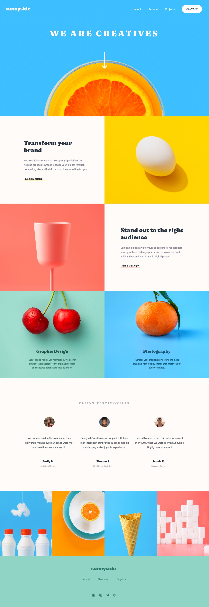

# Sunnyside_Agency_Landing_Page
An organisation's landing page from frontend mentor.

# Frontend Mentor - Sunnyside agency landing page solution

This is a solution to the [Sunnyside agency landing page challenge on Frontend Mentor](https://www.frontendmentor.io/challenges/sunnyside-agency-landing-page-7yVs3B6ef). Frontend Mentor challenges help you improve your coding skills by building realistic projects.

## Table of contents

- [Overview](#overview)

  - [The challenge](#the-challenge)

  - [Screenshot](#screenshot)

  - [Links](#links)

- [My process](#my-process)

  - [Built with](#built-with)

  - [What I learned](#what-i-learned)

  - [Continued development](#continued-development)

  - [Useful resources](#useful-resources)

- [Author](#author)

- [Acknowledgments](#acknowledgments)

## Overview

### The challenge

Users should be able to:

- View the optimal layout for the site depending on their device's screen size

- See hover states for all interactive elements on the page

### Screenshot



### Links

- Solution URL: [Solution intel](https://github.com/Sheikar/Sunnyside_Agency_Landing_Page.git)

- Live Site URL: [Live site](https://sheikar.github.io/Sunnyside_Agency_Landing_Page/)

## My process

### Built with

- Semantic HTML5 markup

- CSS custom properties

- Flexbox

- CSS Grid

- Mobile-first workflow

- [Styled Components](https://styled-components.com/) - For styles

### What I learned

General knowledge on how to use amd implement the html picture tag and srcsets. 

```html

 <picture class="picture">

   	<source media="(min-width: 600px)" srcset="./big/image.jpg">

    <source media="(max-width: 500px)" srcset="./small/image.jpg">

  	

	</picture>

```

The css properties of adding and editing svg files was quite intriguing...

```css

.svg-selector:hover {

  cursor: pointer;

  filter: brightness(0) invert(1);

}

```

I was also able to grasp some info on responsive designing using some media queries...

### Continued development

I want to dive deeper using node, js and their frameworks like react and the likes...

### Useful resources

- [W3 Schools website](https://www.w3schools.com) - General specifications and dust brush offs.

- [Mozilla org](https://developer.mozilla.org)

## Author

- LinkedIn - [Hassan Shakur](https://www.linkedin.com/in/hassan-shakur-4283ab232/)

- Frontend Mentor - [@Sheikar](https://www.frontendmentor.io/profile/Sheikar)

## Acknowledgments

Hat tip to myself for the dedication...
